# Cavern Unreal Template

_By. Patrick Cheng ‘22’, Pearson(Yiqu) Zhu ‘22’_

*Table of Contents*

[TOC]

<h2 id="summary">Summary</h2>

Cave Automatic Virtual Environment RouNd (aka. CAVERN) is a 270 degree circular stereoscopic multiplayer projection system.

This documentation covers how to set up the Unreal Engine environment to utilize the CAVERN. Along with guides on how to set up the Vive Trackers to use in Unreal Engine and CAVERN.

<h2 id="before-starting-checklist">Before Starting - Checklist</h2>

You shouldn’t do anything on this step, just let you know the background context of the nDisplay system. All the applications mentioned below can be found under the task bar.

1. Mosaic & Window Setting: You need to make sure the system setting and Nvidia Mosaic is correctly configured, you can talk with steve to double check.
2. Immersive Display Pro: This software can merge three monitors into one big screen. You need to launch this application before starting the CAVERN.

3. Stereo Setup(if needed): this can make sure under 3D mode the eyes isn’t flipped and stereo system is working 
1. Basic setting for Nvidia Mosaic

2. Stereo Test Software: This software is used to determine whether stereoscopic is working properly.  
In monitor it would look like this

        
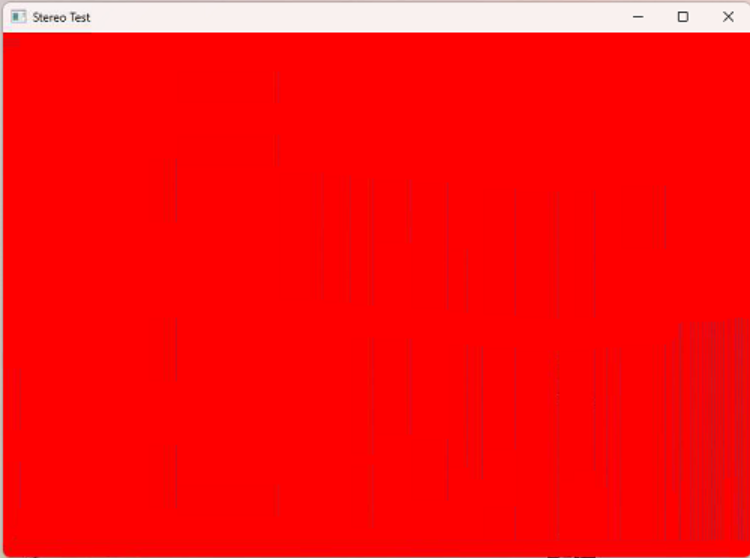

If projector screen, it would look like this

You need to wear 3D glasses to check, you will find your right eye seeing a red screen and your left eye seeing a blue screen (or the other way around). 

4. TigerVNC: Due to limitation of the graphic ports, we can only use remote VNC software to use the computer. 
    1. VNC connection password is: warpme

<h2 id="how-to-run-a-demo-with-cavern-template">How to run a demo with Cavern_Templete</h2>

1. Open switchboard listener

2. Open switchboard（it should be empty on the first launch）

3. Set the project file setting

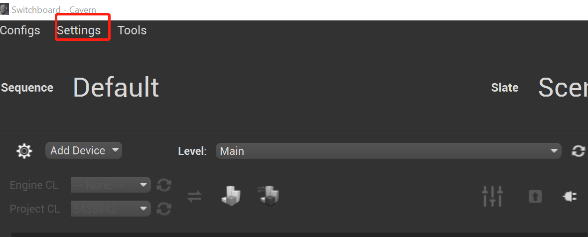

4. Set Ndisplay config (Add Device -> ndisplay)

    

5. Check the render API as well as Render Mode

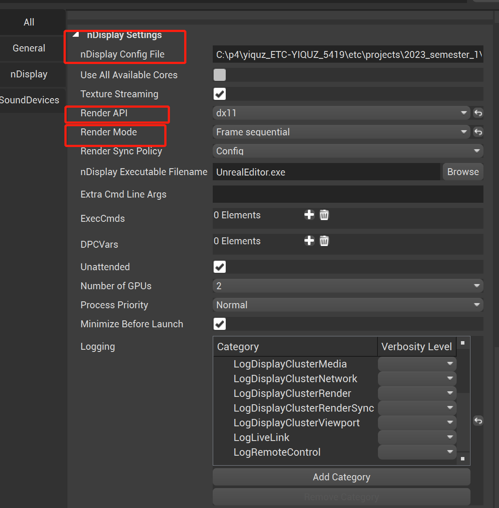

The render API have to be DX11 to use stereoscopic(don’t know the reason!), and render mode should be set to frame sequential.

6. Connect to the switch board listener 

7. Choose the level you want to start with and hit the button

8. If the window isn’t open with full screen, press alt and space and use the arrow key to select ‘maximize’ to solve this (or alt+space, and then hit x on the keyboard). 

<h2 id="how-to-enable-stereoscopic">How to Enable stereoscopic</h2>

To enable stereoscopic you need to make sure

1. In unreal setting you are using dx11
2. In nDisplay switchboard setting you are using dx11

<h2 id="cavern-audio-setup">Cavern Audio Setup</h2>

You wouldn’t have an Audio because nDisplay systems in Unreal don't have a camera (Display!=Camera). You need to manually add an Audio listener. This step is done in template project, but you must know this if you want to change anything in PlayerController

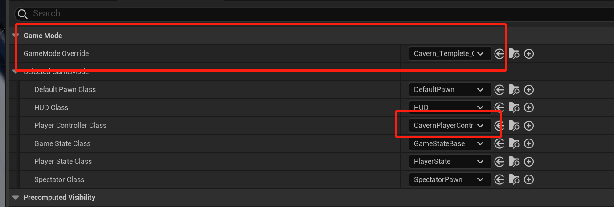

<h2 id="vive-tracker-setup">Vive Tracker Setup</h2>

Below is the setup for how to pair and use HTC Vive Trackers w/wo Hyper Blasters.

This documentation is updated and compatible with **Unreal Engine 5.1.1, [Vive Tracker 3.0](https://www.vive.com/us/accessory/tracker3/)**, and **[Hyperkin Hyper Blaster](https://hyperkinstore.com/hyper-blaster-for-htc-vive-tracker-hyperkin/)** up until April 2023.

If you wish to use the Vive Tracker with the Hyper Blaster, install the Tracker on the Blaster.

(Image of Vive Tracker 3.0, center triangle is black)

**Warning: **Don’t assume Vive Tracker 2.0 or 1.0 will work with this setup.

<h3 id="hmd-setup">HMD Setup</h3>

The initial tracker setup within the CAVERN included connecting to a Valve Index headset in order to use the Index controllers. 

For future followers if only trackers are needed, removal of VR headset could be possible. Remember to follow instructions on [how to set up Vive Trackers without hmd](https://docs.google.com/presentation/d/1BRbucG8PK2eB4w2K1JHAOT5IPWf_UVVTpRraOX29A5o/edit?usp=sharing).

If pairing Vive Trackers with VR headset, then you might want to install [Vive Console for SteamVR](https://store.steampowered.com/app/1635730/VIVE_Console_for_SteamVR/) as well.

Pair Vive Trackers wirelessly through using the dongles provided in the container of the Vive Trackers. 

Tutorial on [how to pair Vive Trackers](https://www.youtube.com/watch?v=3Wg0pAT2xEE).

<h3 id="livelinkxr-setup">LivelinkXR Setup</h3>

LivelinkXR is a plugin that allows you to retrieve the location and rotation of the Vive Tracker in Unreal Engine 5.

1. Select Plugins from the Edit drop down

2. Type in LivelinkXR in the search tab, and install the plugin, restart Unreal if needed

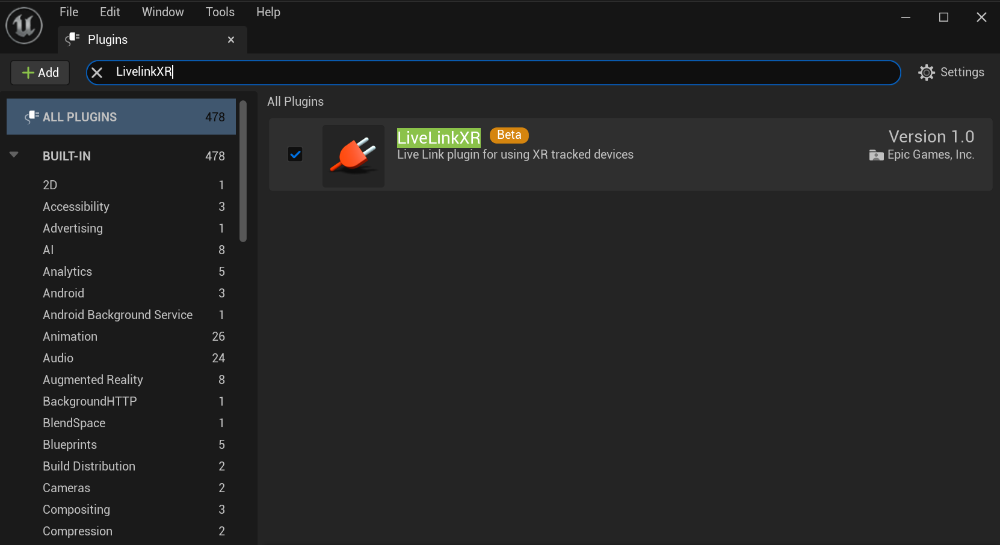

3. From there you can open the Live Link window under Window - Virtual Production

4. Click on +Source, from the drop down select LiveLinkXR Source, use the default settings and select Add.

5. From there, all the paired devices will show up in the window below

(The dots on the right show connectivity, yellow means not connected, green means connected)

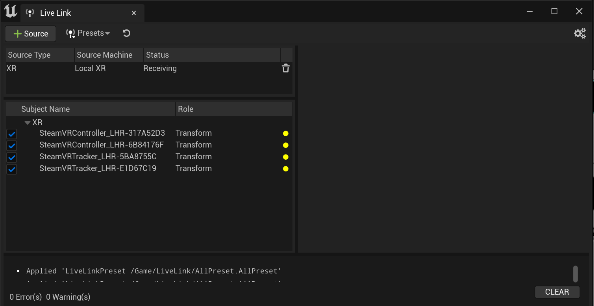

(Not connected)

（Connected)

6. Save as a preset for easier configuration every time you restart Unreal.

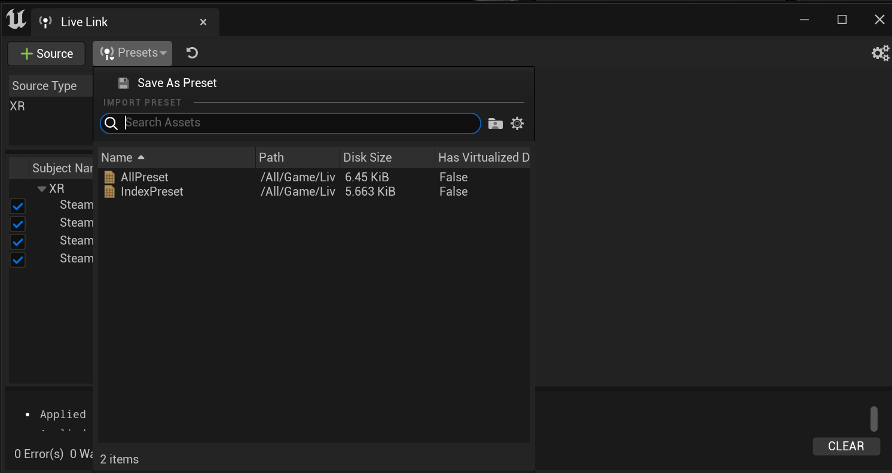

7. Now go to Edit - Project Settings - Input, under bindings - Action Mappings, create two mappings by clicking on the + symbol, give them different names and assign the Vive (L)/(R) Trigger. 

8. Go to a blueprint where the game/scene starts, add a Live Link Preset variable, and add an Apply to Client node whose target is Live Link Preset. InThis allows the user to stream various types of data from a variety of sources and apply that data directly to Actors within their level. [Details.](https://docs.unrealengine.com/5.1/en-US/using-live-link-data-in-unreal-engine/)

9. In the scene under the outliner, select the preset you have created for the LiveLinkXR connection.

10. Select an Actor you want the LiveLink controller(Vive Tracker) to control, add a Live Link Controller component to the Actor.

11. Select LiveLinkComponentController, under Live Link tab select Subject Representation, and choose the tracker you want to control the Actor with. These should be the same names when you are dealing with the [paired devices](#bookmark=id.mcv46y8l5eyl).

12. The Actor will now move with your Vive Tracker within the play area.
13. If you want to use pogo pins on the Vive Tracker, follow the below instructions about SteamVR Setup, if you don’t require pogo pin inputs, you can skip it.

<h3 id="steamvr-setup">SteamVR Setup</h3>

The SteamVr setup is only for using the pogo pin input on the Vive Tracker, if you don’t require pogo pin inputs, this section can be skipped.

Now open SteamVR, this configuration only needs to be completed once and can be reused after. Please make sure the latest version of SteamVR is installed. This documentation is updated and compatible with **SteamVR 1.25.7 **up until April 2023.

1. Open SteamVR, from the menu select Devices - Controller Settings, the window below will appear

2. Select Manage Trackers, change the Tracker Role to Held in Hand, and change the Hand to either Left or Right Hand.

**Warning**: You can only have two trackers to have the same pogo pin inputs, for details about having 3 or more people using input on the Vive Tracker please follow [Tracker Pogo Pin Limitations](#tracker-pogo-pin-limitations).

3. Back to SteamVR menu, select Show Old Binging UI, choose the application that you want to modify the bindings, in this case the Unreal Engine Editor application

4. Click on the box under current controller and change it to Vive Tracker in Hand

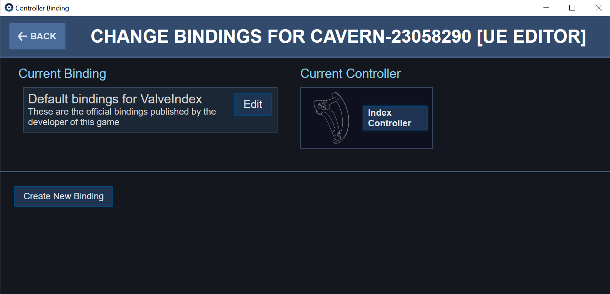

5. Click on Edit, select the + symbol next to Trigger on the corresponding hand you have the tracker assigned to, then select BUTTON in the use Vive Tracker in hand trigger as…

6. Select None, choose the [Action Binding name](#bookmark=id.8ya3pcqfdlxv) you created in Unreal Engine, then click on the check mark to finish. 

    It is helpful to name them with L/R to know which side is left and which side is right.

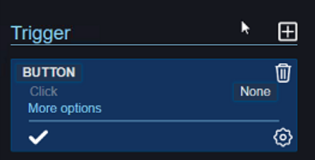

7. Go back to Unreal Engine, open a blueprint where you wish to read the Vive Tracker Trigger inputs. Right click on the background and type in _keyboard event_, select any one of them(in this case I selected T). 

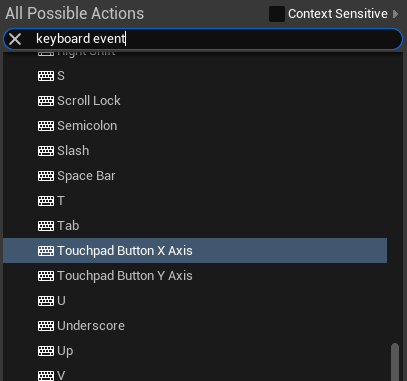

8. Click on the drop down menu on the right, under_ HTC Vive_ select Vive (L)/(R) Trigger for the corresponding trigger input you want.

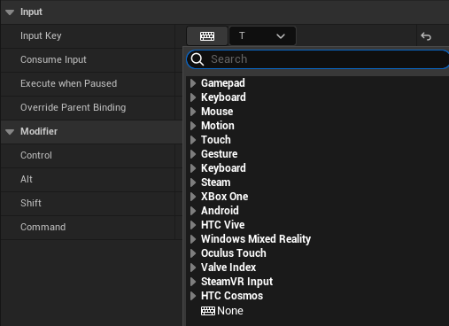

9. The trigger node can be used like the following image. During runtime, you can press the trigger on the hyperblaster to start executing the node.

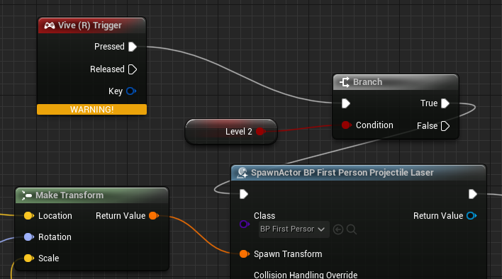

<h3 id="tracker-pogo-pin-limitations">Tracker Pogo Pin Limitations</h3>

* For pogo pin input, there are a max of two inputs for the same pogo pin input across multiple controllers. 
    * For example, if you want to make a multiplayer shooting game using the trigger button on the Hyper Blasters, you can only have 2 doing so. The reason behind this is because in SteamVR setup, Vive Trackers require you to state which hand the tracker represents if you were to use the pogo pins as input. The only choices are left and right hand, so if you assign a third controller to any one of those, the UI binding in SteamVR won’t show the third controller, and the trigger in key events in Unreal will only read L and R inputs for left and right hand. Overall, if you want 3 or more blasters or other controllers using the Vive Tracker pogo pins for the same input (trigger), you can’t.
    * However, it’s possible to have multiple controllers using different input readings. For example 3 blasters, while 2 use the trigger button and the third one using the side button, but you still need to assign the third tracker to left or right hand. Conceptually this is possible, but it has not been done.
    * If you really need more than 2 input, what you can try is only using the tracker to retrieve rotation and location, and glue or tie another bluetooth/wireless one-key keyboard to it. Then you don’t require SteamVR setup for the pogo pin inputs, and can use custom keystroke inputs.
* The Hyper Blasters are the only device that can read Vive Tracker Pogo pin inputs off the shelf (as of April 2023).
    * If you want other shapes or so you can try to make your own, the manual to pogo pin in below.
* If something doesn’t work, try rebooting (Tracker, SteamVR, Unreal, PC, Life).
* For more information, here is the [HTC Vive Tracker Developer’s Manual](https://dl.vive.com/Tracker/Guideline/HTC%20Vive%20Tracker%20(3.0)%20Developer%20Guidelines_v1.0_01182021.pdf).
